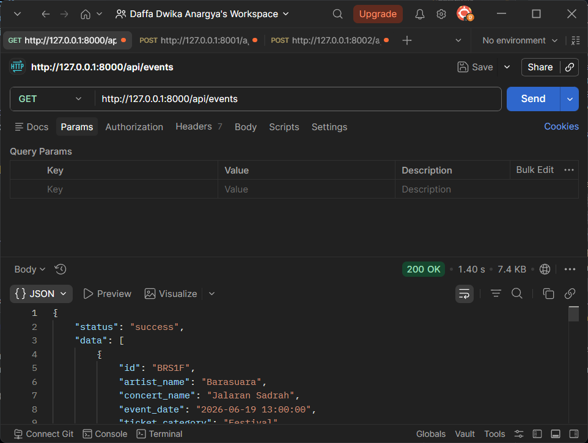
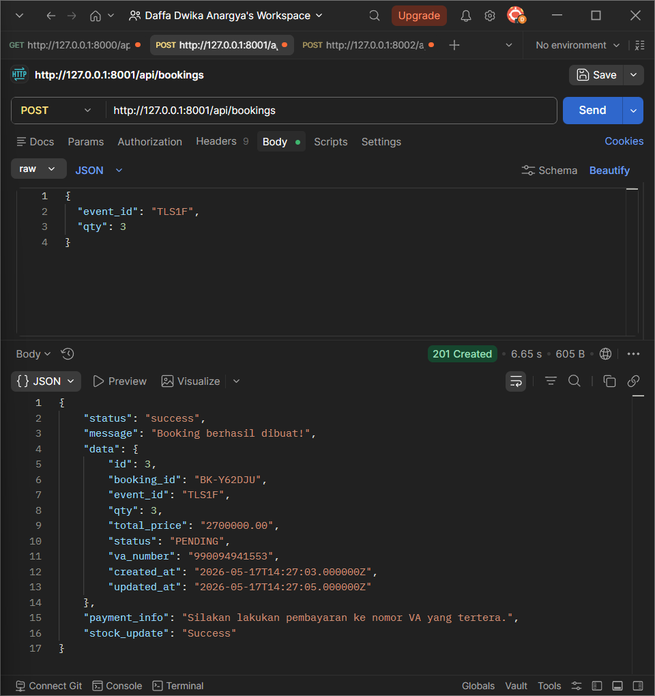
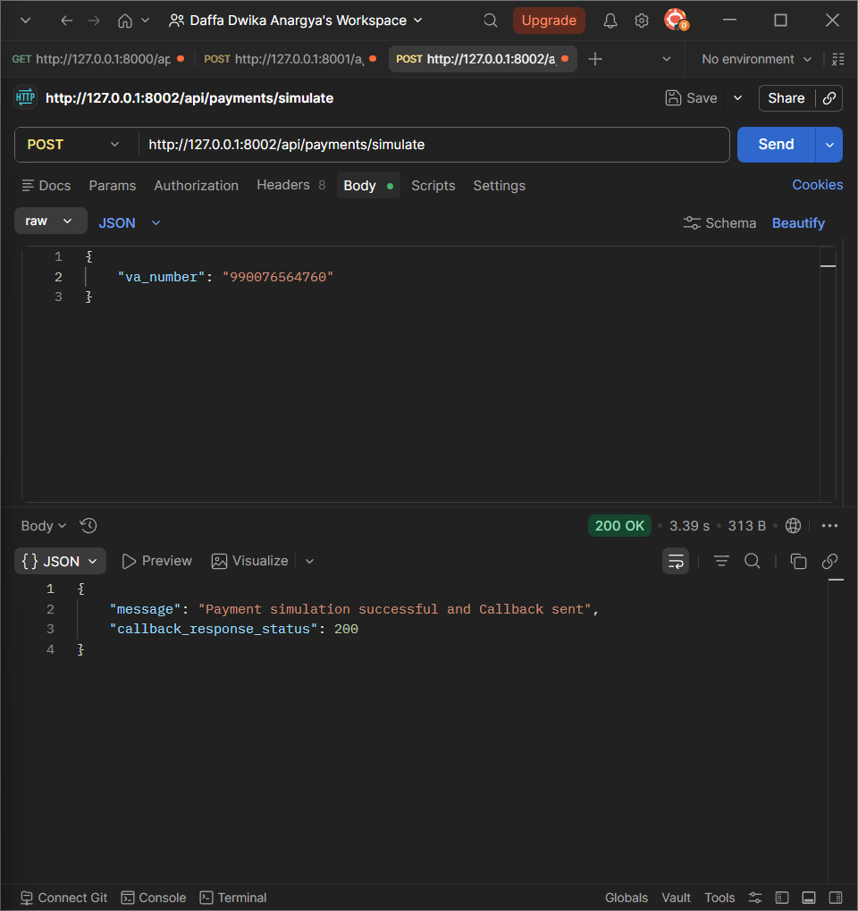

# Fantastic: Platform Pemesanan Tiket Konser

Proyek ini terdiri dari 3 layanan terpisah (microservices) yang saling terintegrasi:
1. **Event Catalog Service**: Mengelola data acara dan tiket.
2. **Ticketing Service**: Menangani proses pemesanan tiket (booking).
3. **Payment Mock Service**: Layanan mock untuk memproses pembayaran.

Berikut adalah langkah-langkah untuk menjalankan dan mendemonstrasikan integrasi ketiga sistem ini secara lokal. Karena database di-host menggunakan **Supabase**, Anda tidak perlu melakukan instalasi database lokal.

---

## Persyaratan Sistem
Pastikan Anda telah menginstal:
- PHP (versi 8.x)
- Composer

---

## Langkah-Langkah Menjalankan Proyek

### 1. Menjalankan Event Catalog Service
Buka terminal baru dan jalankan perintah berikut:
```bash
cd event-catalog-service
composer install
cp .env.example .env
php artisan key:generate
```
- Konfigurasi database Supabase sudah tersedia bawaan dari file `.env.example`.
```bash
php artisan migrate --seed
php artisan serve --port=8000
```
Layanan ini sekarang berjalan di `http://127.0.0.1:8000`.

### 2. Menjalankan Ticketing Service
Buka **terminal baru** (biarkan terminal pertama tetap berjalan) dan eksekusi:
```bash
cd ticketing-service
composer install
cp .env.example .env
php artisan key:generate
```
- Konfigurasi database Supabase sudah tersedia bawaan dari file `.env.example`.
- **Penting:** Pastikan URL untuk service lain telah diatur dengan benar di `.env` jika diperlukan.
```bash
php artisan migrate --seed
php artisan serve --port=8001
```
Layanan ini sekarang berjalan di `http://127.0.0.1:8001`.

### 3. Menjalankan Payment Mock Service
Buka **terminal baru** lagi (terminal ketiga) dan jalankan:
```bash
cd payment-mock-service
composer install
cp .env.example .env
php artisan key:generate
```
- Konfigurasi database Supabase sudah tersedia bawaan dari file `.env.example`.
```bash
php artisan migrate
php artisan serve --port=8002
```
Layanan ini sekarang berjalan di `http://127.0.0.1:8002`.

---

## Cara Mendemonstrasikan Integrasi

Setelah ketiga service berjalan di port masing-masing (8000, 8001, dan 8002), Anda dapat melakukan simulasi dengan menggunakan tools seperti **Postman** atau **Insomnia**:

1. **Lihat Katalog Event**: 
   Kirim *GET request* ke Event Catalog Service (`http://127.0.0.1:8000/api/events`) untuk melihat daftar event dan tiket yang tersedia.\
   *Pastikan untuk mengisi header Accept dengan application/json agar request berhasil.* \
   *Contoh:*
   
   
2. **Buat Pesanan (Booking)**: 
   Kirim *POST request* ke Ticketing Service (`http://127.0.0.1:8001/api/bookings`) dengan menyertakan ID event/tiket dari katalog. Ticketing service akan berkomunikasi dengan Event Catalog Service untuk memvalidasi tiket/stok, serta meminta nomor VA dari Payment Mock Service.\
   *Pastikan untuk mengisi header Accept dengan application/json agar request berhasil.* \
   *Contoh:*
   
   

3. **Proses Pembayaran**: 
   Setelah booking berhasil dibuat, kirim *POST request* untuk pembayaran simulasi ke Payment Mock Service (`http://127.0.0.1:8002`) dengan menyertakan nomor VA dari booking sebelumnya. Status dapat diisi dengan "FAILED" jika ingin mensimulasikan gagal bayar atau dikosongkan jika ingin mensimulasikan berhasil.\
   *Contoh:*
   

---

> **Catatan:** Pastikan tidak menutup terminal selama proses demonstrasi berlangsung, karena setiap service harus tetap menyala agar bisa saling berkomunikasi.
